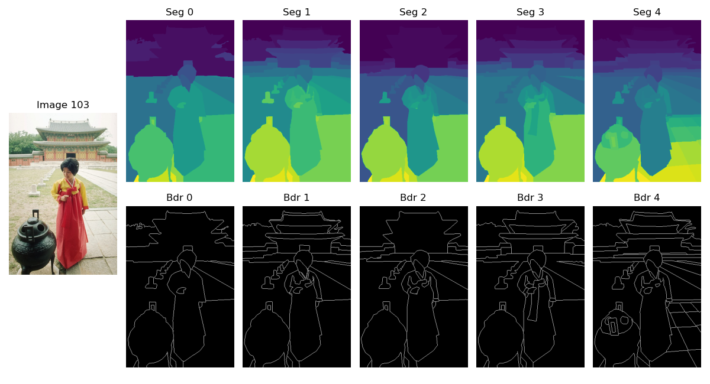

# DataLoader: Berkeley Segmentation Dataset 500

BSDS500 (Berkley Segmentation Dataset) is a dataset primarily for Image segmentation and boundary detection.

**Home Page**: [Berkley Computer Vision Group][dataset-homepage], you can download the entire set from [here][dataset-link]. You can also find it on [paperswithcode][ref1-link].



Some example scripts, showing how to use this dataloader are shared in the [samples](./samples/README.md) folder.

## Table of contents

- [DataLoader: Berkeley Segmentation Dataset 500](#dataloader-berkeley-segmentation-dataset-500)
    - [Table of contents](#table-of-contents)
    - [About the dataset](#about-the-dataset)
        - [BSDS 68 Validation and 432 Train](#bsds-68-validation-and-432-train)
        - [Download](#download)
    - [Module Docs](#module-docs)
        - [Functions](#functions)
        - [Typing](#typing)
        - [Class](#class)
    - [Contents](#contents)
    - [Credits](#credits)

## About the dataset

BSDS500 was made for aiding research on image segmentation and boundary detection algorithms. It contains images and ground truth segments and boundaries. The description about each of them is given below

1. **Images**: There are 500 images in the dataset (200 for training + 200 for testing + 100 for validating). Each image is of shape `321, 481, 3` or `481, 321, 3` (represented as `height, width, 3` - 3 being RGB channels). These are stored as JPG files.
2. **Ground Truth**: These are the segments as well as boundaries for all the images. The annotation task was carried by multiple annotators, and data from each of them is included. Each annotator gives their own _Segmentation_ estimate and _Boundaries_ estimate (the main target / task for which this dataset was created). These are stored (sample-wise) in `*.mat` files (MATLAB 5.0, Platform PCWIN). We're interested in the `groundTruth` variable in this file.
    1. Each sample includes a list of annotators (4 to 9, but 5 on an average; the shape is `[1, num_annotators]` of each sample).
    2. Each annotator (accessed using `[0, i]`) has a [structured datatype object](https://numpy.org/doc/stable/user/basics.rec.html) of type `dtype([('Segmentation', 'O'), ('Boundaries', 'O')])`. This is indexed using the string name (`['Segmentation']` or `['Boundaries']`) and has only one object each (follow with `[0, 0]`).
    3. Each object, whether under segmentation or boundary, has the same shape as the corresponding image.
        1. For a `'Segmentation'` object, the pixel values indicate the _segment_ (group number as integer) it belongs to. This number starts from 1 and can go up to as many segments the annotator has detected.
        2. For a `'Boundaries'` object, the pixel values are either 0 (not a boundary pixel) or 1 (a boundary pixel).

    Example 1: Say we have loaded a `*.mat` file (containing annotations of an image) and retrieved the `groundTruth` variable in `y_gt`. We can retrieve the segmentation annotations of the third annotator by doing: (note that indices start from 0)

        ```py
        y_gt[0, 2]["Segmentation"][0, 0]
        ```

    Example 2: We can retrieve the boundaries annotations of the second annotator by doing

        ```py
        y_gt[0,1]["Boundaries"][0, 0]
        ```

### BSDS 68 Validation and 432 Train

There are 68 images taken from the validation dataset of the original BSDS500 dataset. It is common to use the other 432 image samples for training and these 68 samples for testing. The file names (for these 68 samples) are listed in [BSDS_val68_list.txt](./res/BSDS_val68_list.txt). This file is directly borrowed from [visinf/n3net repository](https://github.com/visinf/n3net) from [here](https://github.com/visinf/n3net/blob/2f23dd42a22ea1c6afbb7fb0deca5d2bfa01cf10/datasets/BSDS_val68_list.txt).

### Download

You can download the dataset from [this link][dataset-link], or you could run the specified command

For Windows **PowerShell**

    ```pwsh
    Invoke-WebRequest -Uri http://www.eecs.berkeley.edu/Research/Projects/CS/vision/grouping/BSR/BSR_bsds500.tgz -OutFile BSR_bsds500.tgz
    ```

## Module Docs

The module has functions (and a class) to dedal with the BSDS500 dataset. The functions are generally sufficient.

### Functions

1. `load_data`: Loads the entire BSDS500 dataset (images, ground truths, paths, everything related to the dataset). The header of this function is described below

    ```py
    def load_bsds500_dataset(zip_file=None, ext_loc=None):
    """
        Calls the load_data function of the dataset and returns the
        dictionary (as it is)

        Paraemters:
        - zip_file: None or str     default: None
            The location of the 'BSR_bsds500.tgz' ZIP file on system. 
            By default (if None), the zip is stored at location 
            '~/.datalines/datasets/' as 'BSR_bsds500.tgz' on the local
            system. If provided, then this must be an existing file, 
            else the file will be downloaded under the given name.
        - ext_loc: None or str      default: None
            The folder location where files are to be extracted. By
            default (if None), the zip is are extracted at location
            '~/.datalines/datasets/BSDS500/' on local system. If
            provideed, this must be a valid path.

        Returns:
        - data_dict: DataSetDict    The dataset dictionary
    """
    ```

    By default, the data is locally cached (and extracted) in `~/.datalines/datasets/` (extracted in `BSDS500` folder at this location). You can pass a custom zip file location (if you've already downloaded it) and a custom extraction point as follows

    ```py
    zip_file = "~/Downloads/Datasets/BSR_bsds500.tgz"
    extract_folder = "~/Documents/Datasets/BSDS500_ext"
    data = load_data(zip_file, extract_folder)
    ```

    Note that the `zip_file` must be a valid file location with `.tgz` extension (file will be downloaded if not available) and the `ext_loc` must be a valid folder location (files will be extracted here if folder doesn't already exist).

    By default, `zip_file` is `~/.datalines/datasets/BSR_bsds500.tgz` and `ext_loc` is `~/.datalines/datasets/BSDS500/`

2. `load_imgs`: Loads only the images part (ground truth is discarded). Provision is there to retrieve the BSD68 (which is 68 images from validation) as test and the remaining 432 as training images. The function header is as follows

    ```py
    def load_imgs_dataset(ds_obj = None, split_data = True):
    """
        Loads the BSDS500 dataset (images only). Training and testing
        split is decided based on the BSD68 dataset.

        Paraemters:
        - ds_obj: DataSetDict       default: None
            The loaded data as dictionary. If None, the function loads
            fresh data. This is usually through BSDS500().load_data()
        - split_data: bool      default: True
            If true, a pair (train_imgs and, test_imgs) is returned,
            else the entire 500 images are returned as a list. The
            splitting happens based on the BSD68 dataset (432 training
            and 68 testing images). If there is no split, then all
            500 images are returned.
        
        Returns:
        IF split_data == True
            - train_imgs: list[np.ndarray]  Images for training
            - test_imgs: list[np.ndarray]   Images for testing
        ELSE
            - imgs: list[np.ndarray]    All 500 images of BSDS500
    """
    ```

    By default, if no `ds_obj` dictionary (already read data) is passed, then only the default options are used. You can use custom paths by doing

    ```py
    zip_file = "~/Downloads/Datasets/BSR_bsds500.tgz"
    extract_folder = "~/Documents/Datasets/BSDS500_ext"
    data = load_data(zip_file, extract_folder)
    train_imgs, test_imgs = load_imgs(data)
    ```

    Note that in any case, if the `split = True`, then there are `432` training images and `68` test images; that is `len(train_imgs)` is 432 and `len(test_imgs)` is 68. If `split_data = False`, then all of them are returned as one list (cannot be later separated).

### Typing

The following types have been declared in the module ([python typing](https://docs.python.org/3/library/typing.html) for IDEs and inference), included in the file [BSDS500.py](./BSDS500.py)

1. `DataSetDict`: The dataset is returned through `load_data` in this dictionary format. It contains all data split into training (200 samples), testing (200 samples) and validation (100 samples).

    ```py
    class DataSetDict(TypedDict):
        training: SingleDataSetDict
        test: SingleDataSetDict
        validation: SingleDataSetDict
    ```

2. `SingleDataSetDict`: A particular segment / split is described as follows

    ```py
    class SingleDataSetDict(TypedDict):
        images: list[np.ndarray]
        groundTruth: GroundTruthType
        paths: PathsDict
    ```

3. `GroundTruthType`: The ground truth information is retrieved and stored in the following manner

    ```py
    class GroundTruthType(TypedDict):
        # Number of annotations (per image)
        na: list[int]
        # Segmentation for every annotator (per image)
        segmentation: list[np.ndarray]
        # Boundaries for every annotator (per image)
        boundaries: list[np.ndarray]
    ```

4. `PathsDict`: The full file paths for each image (`*.jpg`) and ground truth (`*.mat`) is also stored (just for tracking files).

    ```py
    class PathsDict(TypedDict):
        img: list[str]
        gt: list[str]
    ```

### Class

The module has a class which handles the dataset finding, extraction and loading. This class is exposed as `BSDS500_DataSet` and will probably be used very little. The header of this class (which has important variables) is shown below

```py
class BSDS500_DataSet:
    """
        Main class for the dataset handling. Initializing object
        ensures that the data is present, call the `load_data`
        function to load (and return) data.

        Constructor Paraemters:
        - zip_file: None or str     default: None
            The location of the 'BSR_bsds500.tgz' ZIP file on system. 
            By default (if None), the zip is stored at location 
            '~/.datalines/datasets/' as 'BSR_bsds500.tgz' on the local
            system. If provided, then this must be an existing file, 
            else the file will be downloaded under the given name.
        - ext_loc: None or str      default: None
            The folder location where files are to be extracted. By
            default (if None), the zip is are extracted at location
            '~/.datalines/datasets/BSDS500/' on local system. If
            provideed, this must be a valid path.
    """
    # Home location (for package)
    __home_loc = "~/.datalines/datasets"
    # ZIP file location (desired) on system
    __dataset_zip_file = f"{__home_loc}/BSR_bsds500.tgz"
    # Destination folder (for extracting)
    __destination_folder = f"{__home_loc}/BSDS500/"
    # URL for dataset
    __download_url = r"http://www.eecs.berkeley.edu/Research/Projects/CS/vision/grouping/BSR/BSR_bsds500.tgz"
    # Data location (in extract, destination folder)
    __data_loc = "BSR/BSDS500/data/" # Data folder
    # Input data in location (relative to __data_loc)
    __x_tr_loc = "images/train/"
    __x_ts_loc = "images/test/"
    __x_vl_loc = "images/val/"
    # Output data in location (relative to __data_loc)
    __y_tr_loc = "groundTruth/train/"
    __y_ts_loc = "groundTruth/test/"
    __y_vl_loc = "groundTruth/val/"
```

The class handles the dataset download, extraction and storage into a variable. This makes the job easier for loading function (which are recommended over using anything of this class).

## Contents

The contents of this directory are described as follows

| Item Name | Description |
| :---- | :---- |
| [BSDS500.py](./BSDS500.py) | Main class that handles core operations (shouldn't directly be used) |
| [def_load_dataset.py](./def_load_dataset.py) | Useful functions exported to the user for loading the data |
| [\_\_init\_\_.py](./__init__.py) | For python package |
| [samples](./samples/README.md) folder | This is for example scripts that show how to use this data loader |
| [res/BSDS_val68_list.txt](./res/BSDS_val68_list.txt) | **Resource**: List of validation file names belonging to BSDS68 validation set (do **not** change) |
| `figures` folder | Images for this doc |

## Credits

The code for this dataloader can be accredited to `TheProjectsGuy`. The dataset itself can be cited using

```tex
@Article{amfm_pami2011,
 author = {Arbelaez, Pablo and Maire, Michael and Fowlkes, Charless and Malik, Jitendra},
 title = {Contour Detection and Hierarchical Image Segmentation},
 journal = {IEEE Trans. Pattern Anal. Mach. Intell.},
 issue_date = {May 2011},
 volume = {33},
 number = {5},
 month = may,
 year = {2011},
 issn = {0162-8828},
 pages = {898--916},
 numpages = {19},
 url = {http://dx.doi.org/10.1109/TPAMI.2010.161},
 doi = {10.1109/TPAMI.2010.161},
 acmid = {1963088},
 publisher = {IEEE Computer Society},
 address = {Washington, DC, USA},
 keywords = {Contour detection, image segmentation, computer vision.},
}
```

[dataset-homepage]: https://www2.eecs.berkeley.edu/Research/Projects/CS/vision/grouping/resources.html
[dataset-link]: http://www.eecs.berkeley.edu/Research/Projects/CS/vision/grouping/BSR/BSR_bsds500.tgz
[ref1-link]: https://paperswithcode.com/dataset/bsds500

[](https://github.com/TheProjectsGuy)
