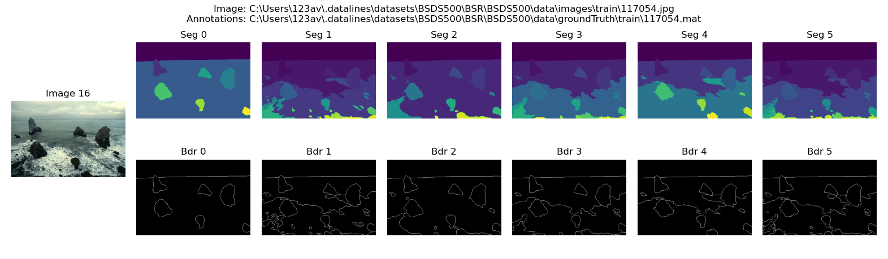

# Samples for BSDS500 Data Loader

Some example scripts for BSDS500 DataLoader. This is not included with the distribution (install). These files are supposed to be run as `main` scripts.

## Table of contents

- [Samples for BSDS500 Data Loader](#samples-for-bsds500-data-loader)
    - [Table of contents](#table-of-contents)
    - [Sample 1: Viewing Image and Ground Truth](#sample-1-viewing-image-and-ground-truth)
    - [Sample 2: BSDS68 Split](#sample-2-bsds68-split)

## Sample 1: Viewing Image and Ground Truth

**Script**: [view_image_gt.py](./view_image_gt.py)

Show a particular sample (image + annotations for segmentation and boundaries)



Shows how to access individual samples and plot them using `matplotlib` [Figure.add_gridspec](https://matplotlib.org/stable/api/figure_api.html#matplotlib.figure.Figure.add_gridspec) (for subplots). For the particular image shown above, the output is

```txt
Dataset already present at C:\Users\123av\.datalines\datasets\BSR_bsds500.tgz
Folders are already unzipped
Loaded 200 training samples
Loaded 200 test samples
Loaded 100 validation samples
Visualizing training set's sample 16
Sample has 6 annotators
Image can be found at 'C:\Users\123av\.datalines\datasets\BSDS500\BSR\BSDS500\data\images\train\117054.jpg'
Annotations can be found at 'C:\Users\123av\.datalines\datasets\BSDS500\BSR\BSDS500\data\groundTruth\train\117054.mat'
```

The system is a Windows system and the user's home folder is `C:\Users\123av`. The particular sample obtained above is a landscape photo.

## Sample 2: BSDS68 Split

**Script**: [split_images.py](./split_images.py)

Shows how to obtain images as 432 (training) + 68 (testing) pair and also as a list of 500 images. Note that there is no easy way of retrieving 432, 68 split from the 500 images (they're not in a particular sequence).

The program output is

```txt
Dataset already present at C:\Users\123av\.datalines\datasets\BSR_bsds500.tgz
Folders are already unzipped
Loaded 200 training samples
Loaded 200 test samples
Loaded 100 validation samples
Split has 68 test and 432 training samples
There are a total of 500 images
```

The system is a Windows system and the user's home folder is `C:\Users\123av`

[](https://github.com/TheProjectsGuy)
